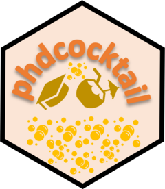

<!-- README.md is generated from README.Rmd. Please edit that file -->

# phdcocktail <a href="https://dahhamalsoud.github.io/phdcocktail/"></a>

<!-- badges: start -->
<!-- badges: end -->

[phdcocktail](https://dahhamalsoud.github.io/phdcocktail/) is a
collection of functions [I](https://dahhamalsoud.github.io) wrote during
my PhD. These functions help: i) effortlessly transform collected data
into a publication-ready format, ii) generate insightful visualizations
from clinical data, iii) report summary statistics in a
publication-ready format, iv) efficiently export, save and reload R
objects within the framework of R projects.

## Installation

You can install the development version of `phdcocktail` from
[GitHub](https://github.com/) with:

``` r
install.packages("devtools")
devtools::install_github("DahhamAlsoud/phdcocktail")
```
